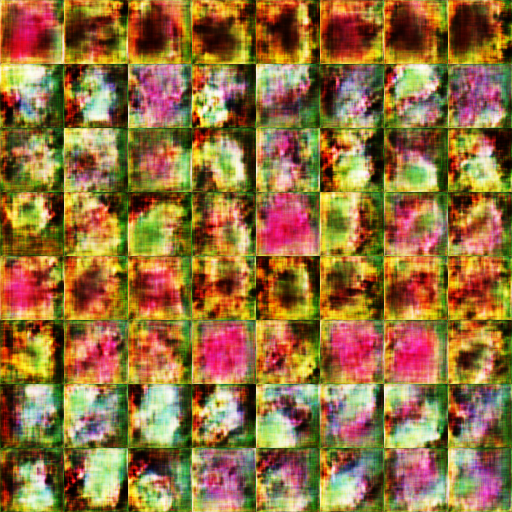
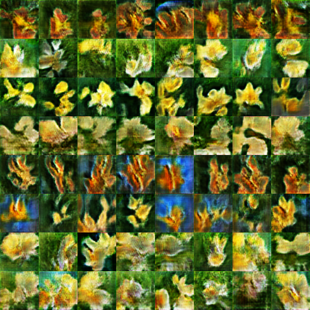
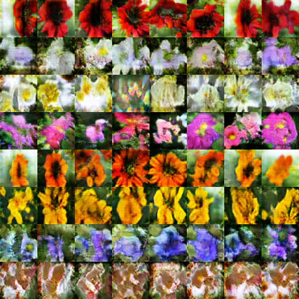
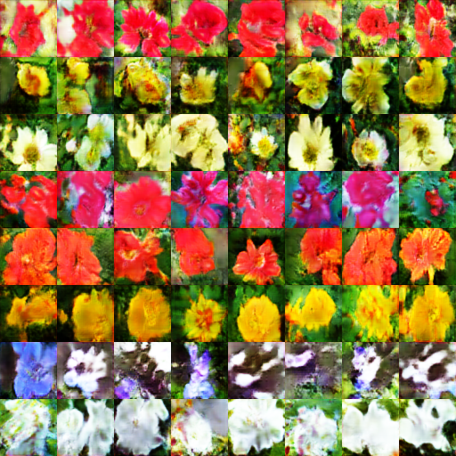
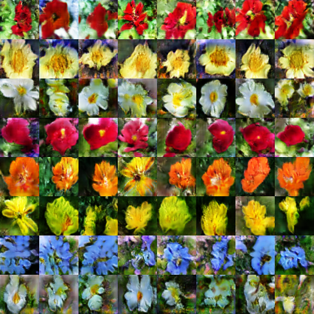
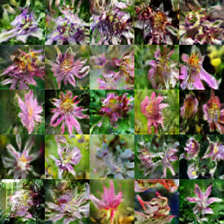

<h1>CS565600 Deep Learning DataLab Cup 4: Reverse Image Caption</h1>

<h3>Team31: Dondon231&nbsp;&nbsp;&nbsp;&nbsp;&nbsp;</h3>

### Trainning epochs
Each row of flowers are generated from one of the 8 captions with different initial noise:  
1. the flower shown has yellow anther red pistil and bright red petals
2. this flower has petals that are yellow, white and purple and has dark lines
3. the petals on this flower are white with a yellow center
4. this flower has a lot of small round pink petals
5. this flower is orange in color, and has petals that are ruffled and rounded
6. the flower has yellow petals and the center of it is brown
7. this flower has petals that are blue and white
8. these white flowers have petals that start off white in color and end in a white towards the tips

10 epochs

100 epochs

200 epochs

300 epochs

700 epochs

* Demo:

